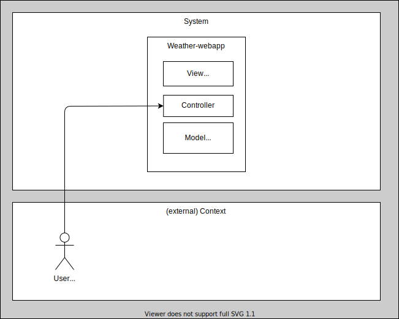
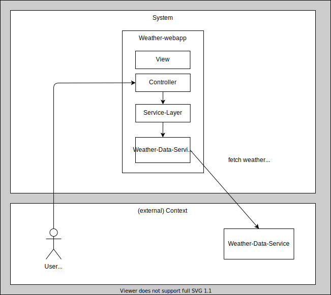
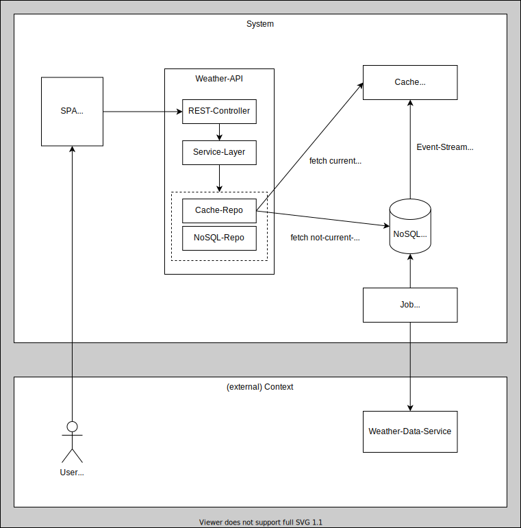
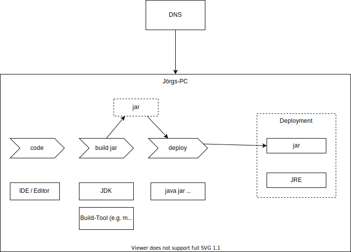
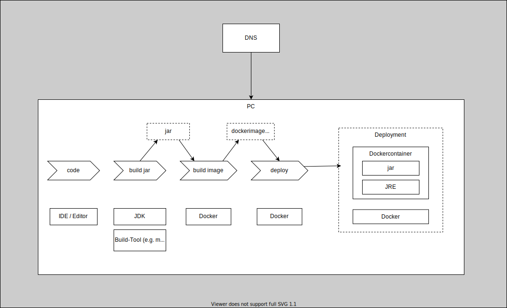
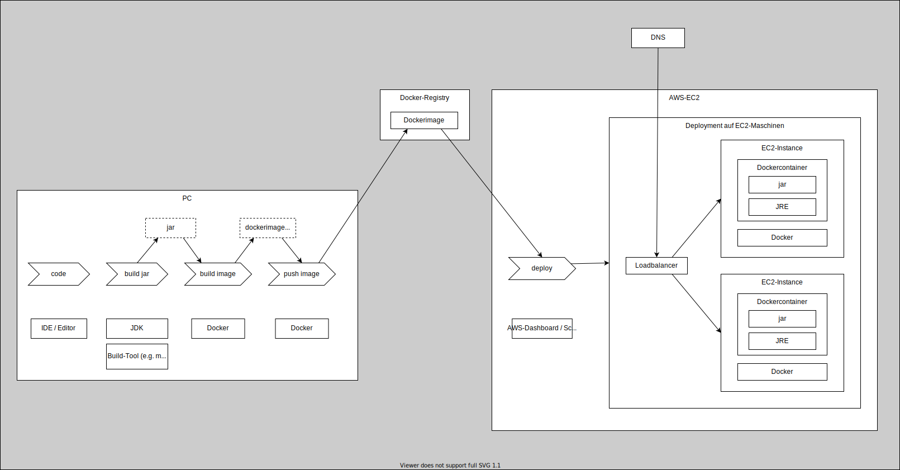

# Best-Weather Architecture
## current state



## next goals
### use external weather-data service


### persistent and cache weather-data


# Deployment-Types
## Local-jar-Deployment
### Outline


### Preconditions
- mvn: ```https://maven.apache.org/install.html```
- java-runtime: ```https://www.oracle.com/java/technologies/downloads/```

### Steps
1. ```mvn clean package && mvn exec:java```
2. open browser: ```http://localhost:8080/v1/weather?location=Nürnberg```


## Local-Docker-Deployment
### Outline


### Preconditions
- mvn: ```https://maven.apache.org/install.html```
- java-runtime: ```https://www.oracle.com/java/technologies/downloads/```
- Docker: ```https://docs.docker.com/desktop/install/mac-install/```

### Steps
1. build jar: ```mvn clean install```
2. build docker-image: ```docker build -t road-to-cloud-native:1.0.0 . --platform linux/x86_64 ```
3. run container: ```docker run --name test -p 8081:8080 road-to-cloud-native:1.0.0```
4. open browser: ```http://localhost:8081/v1/weather?location=Nürnberg```

## AWS-EC2-Deployment
### Outline


### Preconditions (for Quick-Start)
- mvn: ```https://maven.apache.org/install.html```
- java-runtime: ```https://www.oracle.com/java/technologies/downloads/```
- Docker: ```https://docs.docker.com/desktop/install/mac-install/```
- AWS account
- Docker-Registry Account (e.g. github, dockerhub)

### Steps
1. Local-Build + Push-Build to remote Image-Registry:
    1. build jar: ```mvn clean install```
    2. build docker-image: ```docker build -t road-to-cloud-native:1.0.0 . --platform linux/x86_64 ```
    3. tag image: ```docker tag road-to-cloud-native:1.0.0 <dockerRegistry>/<dockerRegistryAccountName>/road-to-cloud-native:1.0.0```

       (=> e.g. tag image: ```docker tag road-to-cloud-native:1.0.0 ghcr.io/procceed-it/road-to-cloud-native:1.0.0```)
    4. push image: ```docker push <dockerRegistry>/<dockerRegistryAccountName>/road-to-cloud-native:1.0.0```

       (=> e.g. push image: ```docker push ghcr.io/procceed-it/road-to-cloud-native:1.0.0```)
2. Deploy to AWS
   1. Login to AWS
   2. Start two EC-Instances with public access for http with user data (start-script) and wait until state of instances is running:
      ```
       #!/bin/bash
       sudo yum update -y
       sudo amazon-linux-extras install docker
       sudo service docker start
       sudo usermod -a -G docker ec2-user
    
      docker run -p 80:8080 --platform linux/amd64 <dockerRegistry>/<dockerRegistryAccountName>/road-to-cloud-native:1.0.0
      # e.g. docker run -p 80:8080 --platform linux/amd64 ghcr.io/procceed-it/road-to-cloud-native:1.0.0
      ```
   3. Create target group and register instances from previous step
   4. Create an internet-facing Application Load Balancer referencing the target group and the corresponding subnets
3. Note Loadbalancer´s DNS name
4. open browser: ```http://<LB-DNS-NAME>/v1/weather?location=Nürnberg```

### Cleanup (for saving money)
- terminate ec2-instances
- delete application load balancer

## Local K8s-Minikube-Deployments
### Outline


### Preconditions
- locale Minikube-Installation ```https://minikube.sigs.k8s.io/docs/start/```
- set Istio-Download/PATH ```https://istio.io/latest/docs/setup/getting-started/``` -> "Download Istio"
- Entries in ```etc/hosts``` (Mac/Linux)
  - ```127.0.0.1 weather.com``` 
  - ```127.0.0.1 weather-app.weather-serverless.weather-knative.com```
- Start Minikube-Cluster with Istio/Knative:
  - ```sh init-k8s-knative.sh```

### K8s-option 1: Standard-Deployment - typical Spring-Boot Applikation
#### Steps:
1. ```sh appk8sstandard.sh```
2. wait a second
3. open browser: ```http://weather.com:8082/v1/weather?location=N%C3%BCrnberg```

### K8s-option 2: Serverless-Deployment - typical Spring-Boot Applikation
#### Steps:
1. adapt appk8sserverless.sh script to your imagename: ```<dockerRegistry>/<dockerRegistryAccountName>/road-to-cloud-native:1.0.0```
2. adapt ```./deploy/k8s-serverless/app-infra-service.yaml``` ->  ```image: <dockerRegistry>/<dockerRegistryAccountName>/road-to-cloud-native:1.0.0```
3. ```sh appk8sserverless.sh```
4. wait a second
5. open browser: ```http://weather-app.weather-serverless.weather-knative.com:8085/v1/weather?location=N%C3%BCrnberg```

Tools for analysis:
- Minikube Dashboard: ```minikube dashboard```


